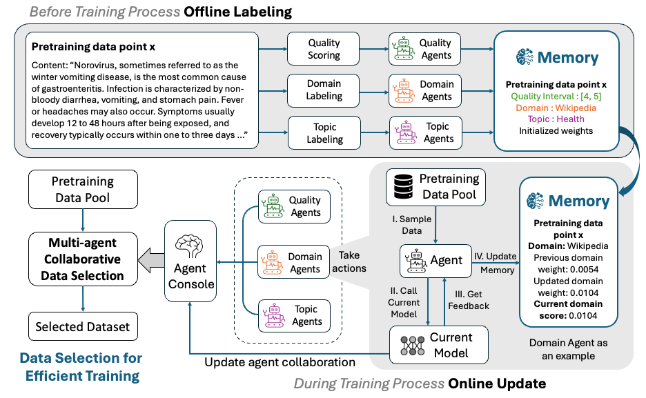

# Multi-Agent Collaborative Data Selection for Efficient LLM Pretraining
This is the repo for the paper (ACL2025)[Efficient Pretraining Data Selection for Language Models via Multi-Actor Collaboration](https://aclanthology.org/2025.acl-long.466/). 

## Updates
- **[5 May, 2025]:** Our paper is accepted by ACL2025! And our code is released.
- **[21 October, 2024]:** We release the [labeled SlimPajama datasets](https://huggingface.co/datasets/beccabai/slimpajama_labeled).
- **[14 October, 2024]:** We release our [1.3B model checkpoints](https://huggingface.co/beccabai/1.3B-multi-agent-collab-checkpoints) and [BERT Topic Classifier](https://huggingface.co/beccabai/bert_topic_model). 

## Release plan
TODOs:
- [x] Model Checkpoints 
- [x] BERT Topic Model Checkpoint 
- [x] Labeled Slimpajama-670B datasets 
- [x] Code for methods
......
